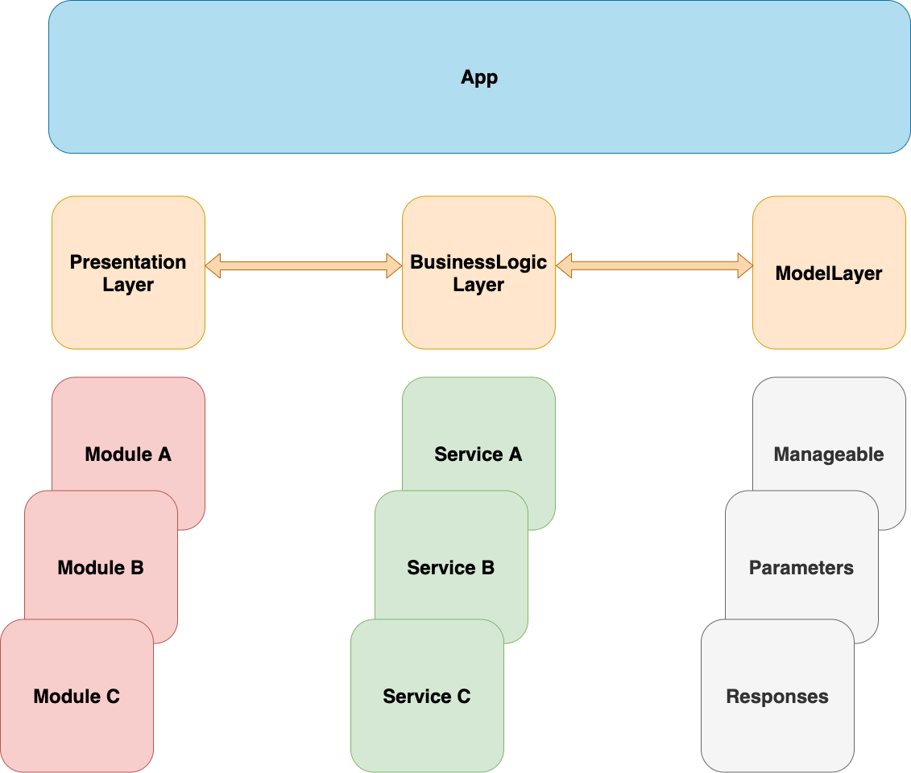
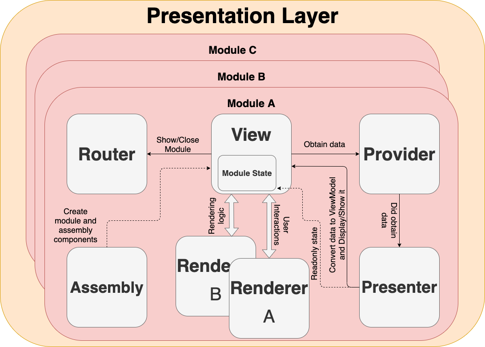
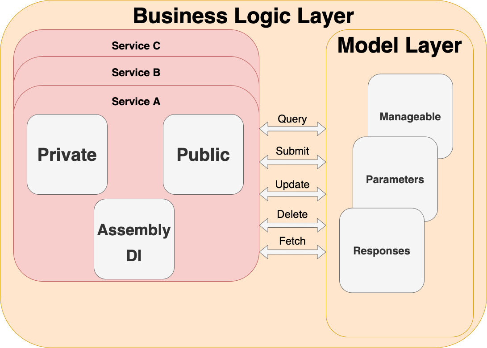

# CArch

## 📄 Архитектура проекта



> [**Presentation Layer**](#Presentation-layer)

* [Assembly](#📒-Assembly)
* [View](#📒-View)
* [Renderer](#📒-Renderer)
* [State](#📒-State)
* [Provider](#📒-Provider)
* [Presenter](#📒-Presenter)
* [Router](#📒-Router)

> [**Business Logic**](#Business-Logic)

* [Private](#📒-Private)
* [Public](#📒-Public)
* [Assembly](#📒-Assembly)

> **Model Layer**

* Managable: можно сохранять в БД
* Parameters: параметры запросов
* Responses: ответы на запросы по API
* UniversalModel: любые параметры/ответ любого запроса

> [**Полный цикл**](#🔄-Полный-цикл)

# Presentation Layer



📄 Вся архитектура завязана на **протоколах**, что обеспечивает подмену каких-либо модулей без нарушения работы приложения.

Для `VC` создается протокол `ХRenderingLogic`, реализующий логику отображения данных.

Для `Provider` создается протокол `ХProvisionLogic`, реализующий логику получения данных из слоя бизнес-логики.

Для `Presenter` создается протокол `ХPresentationLogic`, ссылка на который передается в Provider для последующего вызова.

Для `Router` создается протокол `ХRoutingLogic`, организующий логику переходов от модуля `Х` в другие модули

## 📝 Модуль состоит из:

## 📒 **Assembly**

* **class XAssebly**  
Основная задача - собрать модуль. Тут регистрируются View, Provider, Presenter, Router  
* **struct XModule**
  * class Convertor - конвертирует storyboard, возвращая название ViewController'a.
  * class Builder
    * может быть разным в зависимости от иерархии навигации модуля
    * создать/вытащить из сториборда ViewController, чтобы мы могли передать туда InitialState

* **Есть 2 состояния:**  
        - Первоначальное - что передаем в модуль  
        - Финальное (есть не всегда) - то, что выдает модуль после обработки данных  

Передаем данные в модуль и ожидаем   обработки, получаем на выходе какие-то данные.

## 📒 **View**

> Отвечает только за конфигурацию и взаимодействие с Renderer. В контроллере не должно находиться никакой бизнес логики, взаимодействия с сетью, вычислений и так далее. Его задача обрабатывать события с View, отображать или отправлять данные (без обработки и проверок) в Provider.

Не содержит тяжелой логики, но управляет ей. Все события в основном приходят в него.

**protocol ProvisionLogic** - методы получения данных от Provider.

**typealias UserInteraction** - сбор всех протоколов interaction'ов, которые должны быть объявлены в Renderer

**let moduleReference** - ссылка на Assembly.

## **Жизненный цикл VC**

За жизненный цикл отвечает VC - moduleLifeCycleOwner

**var lifeCycle** - массив рендеров, которые хотят получить событие об изменении жизненного цикла VC.

## **Сборка модуля**

Когда создаем VC, константа **moduleReference** будет инициализирована, срабатывает assembly и мы передаем туда тип модуля (Module.Type), который у нас соответственно и собирается (регистрируется при помощи register view, provider, router, presenter)

## 📒 **Renderer**

Объект части ViewController.

* Отвечает за отображение части экрана (например, cell или tabBar)
* Может обращаться к View и что-то получать
* Повторяет жизненный цикл VC (чтобы View не держала все Renderer и не говорила, что надо делать при изменении определенного события)
* Содержит в себе аутлеты, экшены

У каждого Renderer создается слабая ссылка на VC - *delegate* (он находится внутри Renderer). VC держит ссылку на renderer, чтобы показать интерфейс, а renderer держит ссылку на VC, чтобы сообщить об изменениям на интерфейсе.

Каждый Renderer понимает, что у него есть определенная интерактивность пользователя и он для этого создает интерфейс. View является делегатом этих событий.

set(content: ...) - контент определяется при помощи typealias ModelType

## 📒 **State**

Состоит из 2-ух частей:

*Начального* состояния (initialState) и *финального* (finalState) - держит на них ссылки, они оба являются опциональными.

**ModuleInitialState** - набор данных с помощью которых модуль будет инициализирована

**ModuleFinalState** - набор данных, которые необходимо передать родительскому модулю, например, передать изображение после обработки

В state сохраняем то, что показываем на рендере, но копию

У Presenter есть ссылка на state в качестве **readOnly**

## 📒 **Provider**

Обращаемся к сервису, получаем данные от бизнес-логики. Тут не должно быть логики!

Тут мы сообщаем какие-то проблемы, которые случились, что смогли получить, подписываемся на данные/изменения в БД и так далее.

## 📒 **Presenter**

Подготовка и преобразование данных и предоставление их View.

Есть ссылка на View, чтобы передать туда данные для показа.

## 📒 **Router**

Переходы между модулями.  

# Business Logic Layer



📝 Сервис состоит из:

## 📒 **Assembly**

Отвечает за Dependency Injection сервисов, объявленных в слое Private через инициализатор init.

Сервисами можно считать, например:

* ***HTTP клиент***
* ***Хранилище устройства.***

Пример инъекции зависимостей:

```Swift
func assemble(container: DIContainer) {
    container.record(AccountService.self, inScope: .autoRelease) { resolver in
        AccountServiceImplementation(resolver.unravel(RestIO.self),
                                    resolver.unravel(Repository.self, 
                                    name: RepositoryAssembly.Names.encryption),
                                    authKeychainNew)
    }
}
```

## 📒 **Public**

Блок Public состоит из протокола `xService`, описывающего функции, которые должны быть реализованны в блоке Private.
Протокол должен обязательно наследоваться от базового протокола `BusinessLogicService` . Запрещено создание сервиса, без наследования от базового протокола.

## 📒 **Private**

Блок Private содержит в себе класс `xServiceImplementation`, реализующий функции, описанные в протоколе `xService`.
Так как протокол `BusinessLogicService` (от которого наследован протокол `xService`) содержит в себе инициализатор со всеми необходимыми зависимостями, то именно класс `xServiceImplementation` их инициализирует через:
`init(_ args: Any?...)`
Если у сервера нет зависимости от других объектов, то передается пустой список аргументов.
В случае, если нужный объект зависимости не был найдет в списке аргументов, то процесс инициализации прерывается с фатальной ошибкой.

Также, помимо реализации функций класс `xServiceImplementation` содержит в себе ссылки на ***HTTP*** клиент и/или ***Хранилище устройства***, которые инициализируются в блоке Assembly.

# 🔄 Полный цикл:

Основная логика работы модуля начинается с **View**.

Допустим, нужно получить профиль и отобразить его. 

Во View есть протокол `ХProvisionLogic`. Добавляем туда метод obtainProfile(), который отвечает за получение профиля. Во viewDidLoad() пишем `provider.obtainProfile()` и говорим: провайдер, получи профиль.

## **Provider:**

XProvider имплиментирует XProvisionLogic, который лежит во View.

В провайдер добавляются все сервисы, которые нужны. Это делается через DI, т.е пишется инициализатор, который может принимать сервисы в себя.

```swift
init(presenter: ProfilePresentationLogic,
        accountService: AccountService,
        unauthService: UnauthorizationService,
        pushNotificationsService: PushNotificationService) {
    self.presenter = presenter
    self.accountService = accountService
    self.unauthService = unauthService
    self.pushNotificationsService = pushNotificationsService
}
```

В XAssembly нужно заинъектить их:

```swift
func registerProvider(in container: DIContainer) {
    container.record(ProfileProvisionLogic.self) { (resolver, presenter: ProfilePresentationLogic) in
        ProfileProvider(presenter: presenter,
                        accountService: resolver.unravel(AccountService.self)!,
                        unauthService: resolver.unravel(UnauthorizationService.self)!,
                        pushNotificationsService: resolver.unravel(PushNotificationService.self)!)
    }
}
```

Все методы с сервиса возвращаются, как Promise<[...]>

```swift
func fetchProfile() -> Promise<Profile>
```

Для того, чтобы получить профиль, мы обращаемся к сервису, вызываем метод, а дальше можем использовать compactMap/done/catch и так далее, в зависимости от задачи.

```swift
func obtainProfile() {
    accountService.fetchProfile().then { profile in
        self.accountService.fetchNewsRole().map { ($0, profile) }
    }.done { newsRoleResponse, profile in
        self.presenter.didObtain(newsRole: newsRoleResponse.newsRole, profile)
    }.catch { error in
        self.presenter.encountered(error)
    }
}
```

В файле провайдера есть `XPresentationLogic`, где нам нужен didObtainProfile(), *Profile* - то, за чем мы ходили в провайдер и что было получено, например, с сервера или БД.

## **Presenter**

Делает View из бизнесовой модели.

```swift
func didObtain(_ countries: [Country]) {
    let models = countries.map {
        UICountry(name: $0.name,
                 holder: "#",
                 prifix: $0.phoneCode,
                 mask: $0.phoneMask,
                 flag: $0.flag)
    }
    view?.display(models)
}
```

## **View**

Отображение профиля:

```swift
func display(_ profile: ProfileRenderer.ModelType, _ newsRole: NewsRoleResponse.Kind) {
    renderer.set(content: profile)
    stateRenderer.set(content: nil)
    state.newsRole = newsRole
}
```
